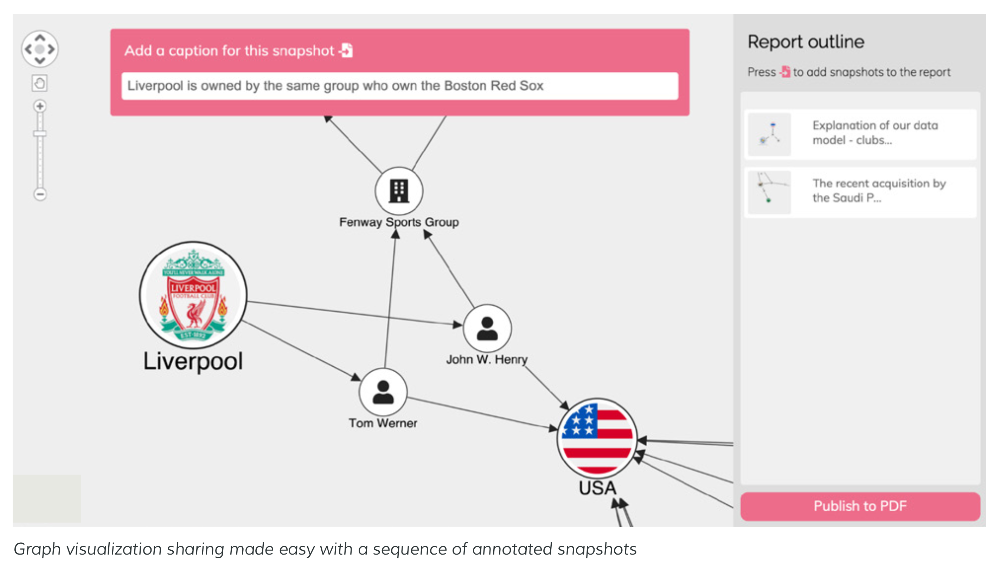

import continuousFlowModel from './continuous-flow-model.png';
import fastChainModel from './fast-chain-model.png';
import efficientChainModel from './efficient-chain-model.png';
import agileModel from './agile-model.png';
import customConfiguredModel from './custom-configured-model.png';
import flexibleModel from './flexible-model.png';

A supply chain is a network of complex connections: between suppliers, partners, processes, systems, customers and more.
Like any busy network, if we can map every item together with the web of links between them, we’ll find it easier to 
understand and manage a smooth-running supply chain.

<!--truncate-->

The Supply Chain Data Challenge
-------------------------------

:::note

An efficient and responsive supply chain relies on good data insights. Supply chain managers know that these give them
the power to mitigate delays, keep down costs, build resilience, and maintain high customer satisfaction.

:::

But how do we find insights in such a complex web of data? All too often, a _lack of visibility_ makes supply chain
issues hard to trace. If we can’t find the cause of a problem fast, or build contingency for a potential threat, the
impact of interrupted flow can be disastrous for our bottom line and brand reputation. The best way to find insights in
any highly-connected dataset is to visualize it.

### Why Network and Timeline Analysis?

To manage a supply chain we need to understand the connections between every stage - from planning, sourcing and 
manufacturing through to transportation, delivery and returns. But we also need to know what happens inside every stage. 
Each can have its own subnetwork of complex relationships, so the entire chain gets very complicated very quickly.

Data visualization is the proven method for making sense of interconnected relationships at scale. When we model supply 
chain data as a graph or timeline, we can visualize it to see what's going on.

Visual Network & Timeline Analysis
----------------------------------

A supply chain is a network of complex connections: between suppliers, partners, processes, systems, customers and more. 
Like any busy network, if we can map every item together with the web of links between them, we will find it easier to 
understand and manage a smooth-running supply chain.

While network analysis reveals insights from relationships, timeline analysis provides answers to the crucial 'when?' 
questions. Timings are key to running an efficient process. When we explore the chronological order of events, from a 
high-level overview right down to minutes and seconds, we can spot time lags, inefficiencies and opportunities for 
improvement.

Supply Chain Models
-------------------

Every supply chain model poses a unique set of challenges. The model we choose depends on the sector we operate in, the
type of product or service we offer, and the pressures we experience to stay competitive.

These six generic supply chain models belong to two groups: the first three focus on **efficiency** while the others are 
geared towards **responsiveness**.

1. **Continuous flow model**: This model works when there's steady supply and demand for a standard set of goods or 
   services. It's a mature model often used by traditional industries where optimizing the speed of flow is the main priority. This suits commodities that have a large customer base that's unaffected by seasonality or market changes.

2. **Fast Chain Model**: Fast fashion is a good example for this model. A low-cost product must go from manufacturer to 
   consumer as quickly as possible before it's repeated with a different product to keep up with continuously-evolving trends. The aim is to get affordable products to market before the competition.

3. **Efficient Chain Model**: If a customer can get the product they want for a similar price from several outlets,
   their choice is often based on brand trust and speed of delivery. Take Amazon and Walmart. They prioritize an
   efficient chain model to stay ahead in a highly-competitive market. To do this, they rely on technology and
   automation for everything from inventory management and warehouse logistics to accurate forecasting.

4. **Agile Model**: Highly-customized or one-off, high value items use a supply chain model tailored to unique
   requirements.

   If a billionaire commissions a bespoke superyacht, they pay a premium for specialist expertise at every stage of
   design, manufacture, production and transportation. It's the opposite of the fast chain model.

   The term 'agile' is also used to describe supply chains that feature practices borrowed from the agile software development manifesto, such as flexibility, closer interactions and responding quickly to change.

5. **Custom Configured Model**: Often seen as a hybrid of agile and continuous flow, this model focuses on customization
   at the assembly and production stages but on efficiency at others. An example would be a furniture manufacturer
   selling an armchair with the option for customers to choose the style, fabric, color, wood and other personalized
   extras.

6. **Flexible Model**: This is for organizations who experience periods of high demand for products or services followed
   by low demand. They must adapt quickly and ramp up production at short notice, but rely on accurate forecasting to 
   prevent unnecessary stockpiles.

   Products aimed at particular holidays or seasonal events follow this model - think about a sudden increase in demand
   for branded merchandise if a sports team unexpectedly makes the playoffs, and an equally sudden drop off if they
   lose.

### Different Models: Same Goals

Whatever supply chain model we choose, industry we are in, or product or service we provide, the overarching goals
remain the same:

- Keep costs down
- Increase profitability
- Reduce risks
- Keep customers happy

Why Visualizing Our Supply Chain
--------------------------------

### Consolidating Multiple Data Sources

Supply chain managers often work with masses of silos containing both structured and unstructured data - think Excel
files of inventories, Bill of Materials in CSV format, CRM systems, etc. Larger organizations rely on an Enterprise
Resource Planning (ERP) system to consolidate this into a single source of truth. Many also use AI and machine learning 
technology for accurate predictions and optimizations.

It's a major challenge to manage and understand what is essentially a vast network of complex connections.

### Identifying Key Activities Faster

How do we optimize a process if we can't see all of it? If we don't have clear end-to-end visibility of the entire
network, we can’t monitor and manage each stage of the supply chain successfully.

Once we visualize our supply chain, it becomes tangible and interactive. **Visualizations reveal the intricate
relationships between every moving part and can raise red flags to highlight when something goes wrong**. It’d be much 
harder and take significantly longer to find these in disparate legacy systems and traditional tabular data formats.

### Predicting Future Behaviors

To fully understand our supply chain, we need to look at the connections in detail. Is there enough stock in our
inventory to meet current demand? When will a vital piece of machinery need servicing? Can our suppliers deliver the
parts we need on time? Is a problematic bottleneck likely to reoccur?

With interactive visualization, it’s easier to make evidence-based predictions based on patterns of behavior. If we use 
machine learning or AI to forecast demand, optimize our production schedule or manage sourcing operations, we will
benefit from visualizing the results. 

### Managing Risk

When machines break down, suppliers go bust or transportation routes are blocked, we can't let our entire supply chain
grind to a halt. There's also a risk of threats from external factors such as terrorist attacks, extreme weather events
or pandemics. Delays are expensive, so we need to adapt to unexpected change fasts.

**Successful supply chains have contingency plans built into the model**, and visualizations help bring these to life. 
Working with a supply chain digital twin allows for testing 'what-if' scenarios. We can test and analyze the impact of 
everything from supply and demand variables to delivery risks, component shortages to the impact of a global sales
promotion.

If a distribution center is taken out of service, managers need to reroute goods to avoid delays. With geospatial visualizations built in, our toolkits show the data on whatever mapping system we use. There are also advanced graph algorithms to cut through the data and find the most efficient routes between nodes.

### Compliance & Traceability

Regulations apply to most stages of any supply chain. They could be about complying with domestic or foreign employee
labor laws or monitoring the use of restricted or hazardous materials, carrying out due diligence on partners as a legal 
requirement or measuring performance against sustainability goals. We need a robust approach that's easy to understand
yet flexible enough to update when those regulations change.

To help with this, we also need to make sure every component, item or event in our chain is fully traceable.

### Full Transparency

It's important to be able to share supply chain information with the right people at the right time in the right format. 
Disclosing details at each stage in real time might be a legal obligation to comply with regulations, a requirement of
our stakeholders, or an essential record of our organization's commitments to sustainability.

Whoever our audience is, they'll find visualizations of real-world entities and detangled networks instantly
recognizable. They're easily accessible too. We can share access to interactive charts with colleagues and stakeholders
with a URL. For more formal static output, simply export and share graph and timeline visualizations in a range of
popular formats, building snapshots into reports as you go.

Supply Chain Visualization Use Cases
------------------------------------

### Simplifying the Complex World of Vehicle Production

Vehicle production has always been complex. When a standard car has 30,000 parts, every stage of the global supply chain 
must be carefully managed, optimized and synchronized.

Relying on so many separate raw materials, component suppliers, fabricators and manufacturers makes the margin for error
much higher. And delays to one part of the supply chain have a catastrophic effect further down the line.

New threats have made a difficult task even more challenging:

- Shortages of key components, particularly semiconductors
- Sudden and prolonged factory closures due to COVID-19-related lockdowns
- Disruptions to shipments due to global conflicts
- Increased energy costs making it harder to keep down costs

Supply chain managers in the automotive industry already rely on modern, real-time Enterprise Resource Planning (ERP) 
systems to manage the flow between each of their business processes. But these systems are rarely integrated with the
other sources of information needed to truly understand the automotive supply chain. Product Lifecycle Management
systems, Bill of Materials (BoM) data, material supplier declarations and safety datasheets, supplier approvals: each
play a role in building up an accurate picture of supply chain risk and performance.

Let's see how our graph and timeline visualization technology delivers customized visibility to different use cases
within automotive vehicle production.

#### Graph Models for Proactive Compliance

Every stage of the automotive supply chain looks like a complicated network of connections, and none more so than the 
earliest stages where raw materials are sourced. Consider the chemical composition of each type of plastic or rubber, or 
corrosive-resistant chrome coatings, or the adhesives used during manufacturing. And every chemical used must comply
with legal obligations, such as the EU’s directive on Substances of Very High Concern (SVHC).

Visualising supplier declarations and BoM data can give a clear picture of your entire dataset and the connections that 
exist within it.

It also reveals the highest potential risks. Complex, interrelated structures represent a single chemical that's used 
indirectly by many others. What would happen if it became obsolete? To prevent it from bringing our supply chain to a 
standstill, we can use impact analysis with advanced graph algorithms to model ‘what if?’ scenarios.

#### Graphing Our Supplier Network

We can't overstate the importance of finding the right suppliers. Measuring the quality, reliability and cost is a
routine part of our due diligence, but with so much riding on the decision, we want to be sure we outsource activities
to the right partners.

We can use graph technology to analyze the broader ecosystem of potential suppliers - everything from which other 
organizations they have supplier agreements with and what their trust rating is, to their geographical presence in
target regions.

#### Making Specialist Knowledge Accessible

Storing huge sets of information, such as a vehicle’s BoM, in databases makes good sense initially. Masses of valuable datasets are stored in a variety of formats. But to unlock their potential and reveal insight, we need to make the data accessible, interact with it and bring it to life.

#### Overcoming Geo-Related Issues

To avoid the costs and other negative impacts of transportation delays, original equipment manufacturers are
increasingly looking at the physical distances between critical suppliers. Local suppliers will shorten their supply
chain, avoid problematic shipping channels, and improve reliability. It also helps to reduce the organization’s carbon 
footprint and contributes to sustainability goals.

Integrating visualizations with geospatial data is easy to achieve with your mapping tile of choice. We can then use
clever techniques such as finding the shortest path or alternative routes if there’s an issue between target freight 
locations.

