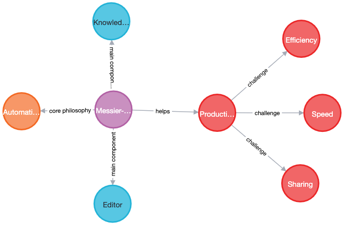

Concepts
========

nexusgraph is organized into 2 components:

1. Editor
2. Graphing Area that displays a knowledge graph representatin inside the editor

Each component can be swapped with their own implementation.

nexusgraph's core philosophy is to automating personal knowledge management with the help of machine learning
techniques, spotlighting the insights about what we learned and representing them in a brand-new technology via
knowledge graph. At the same time, nexusgraph aims to build a knowledge-graph-based personal knowledge management
platform by making some of its capabilities reusable and customizable by communities. On this page, we describe a
typcal knowledge management workflow and where nexusgraph fits in.

The Knowledge Management Workflow
---------------------------------

Traditional knowledge management requires a lot of inefficient manual work. Taking a book reading notes, for example,
takes a lot of time to read the book, note organization, and make connections about the concepts in the book in reader's
own technique. Once finished reading, the reader came back after 6 months only to find they cannot recall anything but
a large corpus of text

Being productive with personal knowledge management can therefore be challenging for several reasons:

- **It's difficult to recall vividly from traditional reading notes**. The more detailed the notes are, the more time
  we need to spend on re-reding the notes after 6 monts.
- **It's difficult to pre-evalutate the knowlege we are learning and consuming**. How many times did people picked up
  a new book and spend couple of hours skiming through it only to find that the book doesn't help them much?
- **There’s no standard way to share knowledge among people**. You have a fantastic learning, put them down on some
  media, and send them to your friend, who later ask you: "What the heck is this?"

Moreover, although there are already knowlege-graph based toosl out there, such as
[RoamResearch](https://roamresearch.com/) and [Obsidian](https://obsidian.md/), to get the best out of personal
knowledge management still requires lots of manual work and their graph visuals are very "preliminary". To summarize,
they focus introduct knowledge graph to people in daily lives. nexusgraph, however, makes people love knowledge graph.

nexusgraph Components
---------------------

nexusgraph provides 2 components to help manage our daily knowledge consumption:

**Editor** is a traditional input tool for our user. Our user should find it very similar to the existing online editors
we find everywhere

**Graphing Arae** is an UI for visualizing knowledges, concepts, and connections between them. People can type some
ideas in the editor area and a knowledge graph representation of that idea will show immediately in the graphing area.

Example Use Cases
-----------------

There are multiple ways people may find nexusgraph useful, whether you are a student taking class notes or someone
working in office trying to analyze and solve some complex problems

**Students** can use nexusgraph to visualize the new concepts learn in class, helping them to better understand the
connections between multiple new ideas

**People trying to tackle a challenge in daily or work environment** can let nexusgraph collect various information for
them, visualize the information using a knowledge graph, and ultimately allowing them to see the problem from different
perspective.
