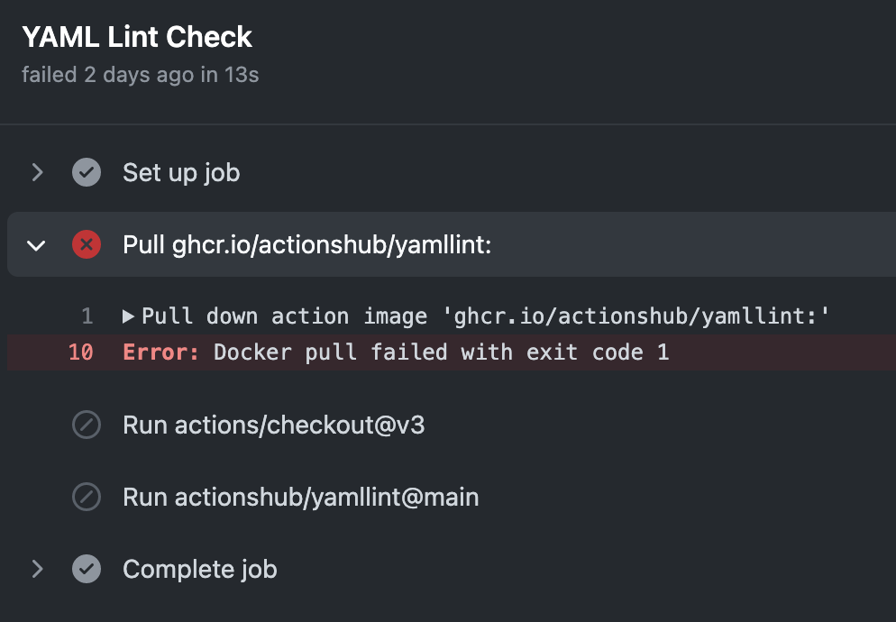
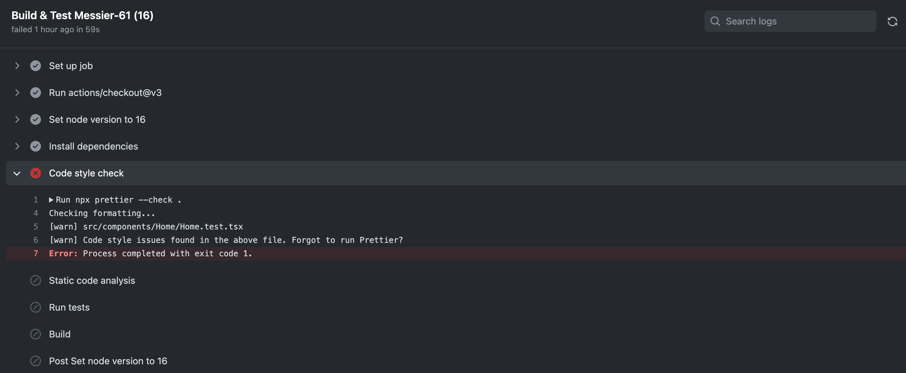

Testing
-------

1. Code style check

   - YAML lint
   - Markdown lint
   - Markdown link check

2. Build and test Messier-61

   - The build process checks code style again using [Prettier][Prettier]
   - The process also runs static code anslysis using [ESLint][ESLint]

     :::caution

     ESLint currently does not run on documentation source codes, i.e. `/docs`

     :::

   - The tests are run using `npm test` in Jest framework

3. Test Build Messier-61 Documentation

Release Process
---------------

### Messier-61

1. [Comprehensively test](#testing)
2. Fetch the tags from the adjusted remote
3. Get the last tag on the working branch
4. Build (`.github/upversion.py`) and push the new tag as the new release version.
5. Bump Messier-61 version the new release version
6. Push Messier-61 to [NPM registry][Messier-61 npm repo]
7. Publish [documentation](#messier-61-documentation) to GitHub Pages

### Messier-61 Documentation

[GitHub Actions][GitHub Actions] allow us to automate, customize, and execute our software development workflows right
in our repository. This also applies to our documentations.

Messier-61 documentation source resides in the master branch under [docs/][Documentation source root] directory

The CI/CD for documentation achieves 2 goals:

1. When a new pull request is made to `master`, there's an action that ensures the site builds successfully, without
   actually deploying. This GitHub workflow job is called `test-doc-build`.
2. When a pull request is merged to the `master` branch, it will be built and deployed to the `gh-pages` branch. After
   that, the new build output will be served on the GitHub Pages site. This job is `deploy-documentation` called deploy.

:::info

The documentation build is a 2-step process:

1. A regular [Docusaurus `build`][Docusaurus Build] command that generates the static HTML of
   [documentation site][documentation]
2. An execution of TypeDoc Node API that generates the [Messier-61 API documentation][documentation on API]

The output of both of the 2 steps above will be picked up and pushed to GitHub Pages for serving.

:::

:::caution

The TypeDoc would require each package to have their dependencies installed locally in order for the TypeDoc execution
to succeed. This means we must `cd` into each packages under [packages][[Messier-61 packages source] and execute
`npm install`. This has been reflected in our CI/CD scripts. See
"Install Messier-61 dependencies so that TypeDoc process source files properly" step of our
[testing script][Messier-61 test CI script]

In general, package source code dependencies (i.e. any dependencies required by packages under `packages`) are not to be
added to doc dependences (i.e. `doc/package.json`).

:::

Troubleshooting
---------------

### Error: Docker pull failed with exit code 1

We found that one of our CI/CD jobs broken itself without any code change on Messier-61 side:



In most cases this is not a Messier-61 issue, but an [upstream service][GitHub Packages] downtime issue. The best of
what we can do is focusing on other priorities and come back later after the upstream fixes the issue.

### Code Style Check Error



Messier-61 uses [Prettier][Prettier] as code style checker. The error above indicates that Prettier found some styling
issues. To fix those, simply run the following command at the root of Messier-61 project and re-push the code:

```bash
npx prettier --write .
```

:::info

Alternatively, we can have Prettier watch for changes from the command line by using our integrated
[onchange][onchange]:

```bash
npm run prettier-watch
```

:::

[Documentation source root]: https://github.com/QubitPi/Messier-61/tree/master/docs

[ESLint]: https://eslint.org/

[GitHub Actions]: https://docusaurus.io/docs/deployment#deploying-to-github-pages
[GitHub Packages]: https://github.com/features/packages

[Messier-61 npm repo]: https://www.npmjs.com/package/@paiondata/messier-61
[Messier-61 packages source]: https://github.com/QubitPi/Messier-61/tree/master/packages
[Messier-61 test CI script]: https://github.com/QubitPi/Messier-61/blob/master/.github/workflows/test.yml

[Prettier]: https://prettier.io/
