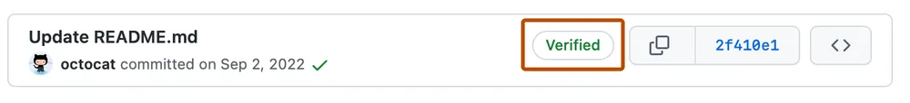

This guide steps you through configuring a local development environment for the Nexus Graph on macOS and Linux. If
you're using another operating system (Plan 9, BeOS, Windows, …) the instructions are still roughly the same, but we
don't maintain any official documentation for anything else for now.

Read about known issues in [the troubleshooting section](#troubleshooting).

Development Environment
-----------------------

This will guide you through manually setting up your development environment.

### Clone the Repository

To get started, clone the [repo](https://github.com/paion-data/nexusgraph) or your fork.

```bash
git clone git@github.com:paion-data/nexusgraph.git
cd nexusgraph
```

We're going to be working out of this repository for the remainder of the setup.

### System Dependencies

Let's make sure that our system is ready for Nexus Graph.

#### Xcode CLI tools (Mac specific)

We'll need to first install Xcode CLI tools. Run this command and follow the instructions:

```shell
xcode-select --install
```

#### Brew

Install [Homebrew](http://brew.sh), and then run the following command to install
[GPG](https://formulae.brew.sh/formula/gnupg) as we will [need it later](#signing-commits-with-gpg-key)

```shell
brew install gnupg
```

### Node 16 & Yarn

Installing [node.js][node.js] and [Yarn][yarn install]:

```bash
npm install --global yarn
```

Bootstrap
---------

Nexus Graph uses [yarn workspace](https://classic.yarnpkg.com/lang/en/docs/workspaces/) to manage different components.
The command below shall install all the dependencies and put them in `node_modules`:

```bash
yarn
```

Once this command has finished we'll have Nexus Graph ready in development mode with all its required dependencies.

Running the Development Server
------------------------------

Now we can run the development server at `http://localhost:3000`:

```bash
yarn start
```

### Available Scripts

After that, inside _nexusgraph_ directory, we can run several commands:

- `yarn start`: Runs the app in the development mode. Open `http://localhost:3000` to view it in
  the browser. The page will reload if you make edits. You will also see any lint errors in the console.
- `yarn test`: Runs all tests, including unit and integration tests
- `yarn build`: Builds the app for production to the `build` folder. It correctly bundles React in production mode and
  optimizes the build for the best performance. The build is minified and the filenames include the hashes.

Happy building awesome knowledge graph app!

Writing TypeDoc
---------------

The [nexusgraph API][API] page was automatically generated by [TypeDoc][TypeDoc], which parses the inline documentation
of nexusgraph source code. To generated them locally

```bash
cd docs
yarn typedoc
```

We can have TypeDoc watch for changes from the command line by using

```bash
yarn typedoc-watch
```

Submitting Code
---------------

### Signing Commits with GPG Key

The purpose of GPG key is to sign the code for the authorship of our contributor.



This section teaches how to create a GPG key locally, upload it to GitHub, and use to sign future commits.

#### Create GPG Key Locally

In terminal, execute

```bash
gpg --full-generate-key
```

- key size must be **4096** bits
- email must be the one associated with your GitHub account

To obtain the GPG key ID created just now:

```bash
gpg --list-secret-keys --keyid-format=long
```

An example output might be:

```bash
$ gpg --list-secret-keys --keyid-format=long
/Users/hubot/.gnupg/secring.gpg
------------------------------------
sec   4096R/3AA5C34371567BD2 2016-03-10 [expires: 2017-03-10]
uid                          Hubot <hubot@example.com>
ssb   4096R/4BB6D45482678BE3 2016-03-10
```

In the example above, the **GPG key ID is 3AA5C34371567BD2**; _we will be using this key ID in the following
discussion_

:::info

In case we would want to delete that key, we could do so by

```bash
gpg --delete-secret-keys 3AA5C34371567BD2
```

:::

#### Configuring git to Use GPG Key

We now instruct `git` to pick up the GPG key at every git commit:

```bash
git config --global user.signingkey 3AA5C34371567BD2
```

#### Uploading GPG Key to GitHub

Printout the GPG key in ASCII armor format:

```bash
gpg --armor --export 3AA5C34371567BD2
```

Copy the command output, i.e. the GPG key, including the **-----BEGIN PGP PUBLIC KEY BLOCK-----**, the
**-----END PGP PUBLIC KEY BLOCK-----**, as well as the contents in between.

Then following the [official documentation][GitHub - uploading GPG key] to upload the GPG key onto your GitHub account.

##### Signing Commits

:::info

If this is your first time submitting code using _git_, make sure to bind your GitHub username and account email first:

```bash
git config --global user.name "<username>"
git config --global user.email "<email>"
```

- Substitute `<username>` and `<email>` with your account info accordingly

:::

To commit with GPG-signed:

```bash
git commit -S -m "<commit message>"
```

where

- `-S` tells git to sign the commit with GPG key
- `<commit message>` should be adjusted accordingly

:::tip

If the commit command above errors with **gpg: signing failed: Inappropriate ioctl for device** message,
[execute][GitHub - gpg signing erro]:

```bash
export GPG_TTY=$(tty)
```

then re-run the commit

:::

### Submitting

Before committing your code, please run the following checks locally in order to give ourselves better confidence that
the code will pass the automated checks online:

1. Prettier our code:

   ```bash
   npx prettier --write .
   ```

2. Check code style using ESLint:

   ```bash
   npx eslint .
   ```

   :::caution

   ESLint currently does not run on documentation source codes, i.e. `/docs`

   :::

3. Run all tests

   ```bash
   yarn test
   ```

Troubleshooting
---------------

### Docusaurus Relative Linking is Treated False-Negative by CI Markdown Link check

CI check for Markdown link (`markdown-link-check`) is turned on and it's not smart enough to detect relative linking by
Docusaurus. The workaround is to disable the link check at the relevant line. For example:

```markdown
<!-- markdown-link-check-disable -->
known. Additionally, this process makes it easy to implement a [blue-green deployment](continuous-delivery) or
<!-- markdown-link-check-enable -->
```

### ESLint Reports False-Negative

Suppose we have the following TypeScript code

```typescript
node.radius + 25;
```

but ESLint complains that

```bash
error  Operands of '+' operation with any is possible only with string, number, bigint or any  @typescript-eslint/restrict-plus-operands
```

And we are sure that `node.radius` by definition is a `number`. This could happend due to the incorrect import, which
results `node` type not properly imported. As a result, TypeScript sees `node.radius` as to type `any` because it
doesn't know what type `node` is

[API]: https://paion-data.github.io/nexusgraph/api

[GitHub - gpg signing erro]: https://github.com/keybase/keybase-issues/issues/2798#issue-205008630
[GitHub - uploading GPG key]: https://docs.github.com/en/authentication/managing-commit-signature-verification/adding-a-gpg-key-to-your-github-account

[node.js]: https://nodejs.org/en

[onchange]: https://www.npmjs.com/package/onchange

[TypeDoc]: https://typedoc.org/guides/overview/

[yarn install]: https://classic.yarnpkg.com/lang/en/docs/install/#mac-stable
