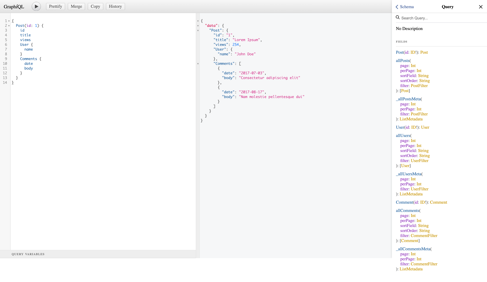

Get a knowledge graph data API throught GraphQL quickly.

Although loving to learn GraphQL, every developer and everyone who simply wants to explore nexusgraph quickly don't want
to first read a book about GraphQL Types and Queries, then install a gazillion npm packages.

nexusgraph-graphql-server allow us to start playing with some graph data exposed via GraphQL right away. All it takes is
a JSON of our data.

nexusgraph-graphql-server is backed by [json-graphql-server][json-graphql-server]

Follow the guide below starting from scratch.

### Create a Data File

Our data file should be a standard JSON file containing an object where the keys are the entity types. The values should
be lists of entities, i.e. arrays of value objects with at least an `id` key. For example, let's create the file named
**data.json** with the following contents:

```json
{
   "posts":[
      {
         "id":1,
         "title":"Lorem Ipsum",
         "views":254,
         "user_id":123
      },
      {
         "id":2,
         "title":"Sic Dolor amet",
         "views":65,
         "user_id":456
      }
   ],
   "users":[
      {
         "id":123,
         "name":"John Doe"
      },
      {
         "id":456,
         "name":"Jane Doe"
      }
   ],
   "comments":[
      {
         "id":987,
         "post_id":1,
         "body":"Consectetur adipiscing elit",
         "date":"2017-07-03"
      },
      {
         "id":995,
         "post_id":1,
         "body":"Nam molestie pellentesque dui",
         "date":"2017-08-17"
      }
   ]
}
```

### Start the GraphQL Server

Navigate into nexusgraph-graphql-server package

```bash
cd nexusgraph/packages/nexusgraph-graphql-server
```

and start the GraphQL server on localhost, port 3000:

```bash
npm start -- <path to JSON data file>
```

:::caution

Note the `--` separator in the command above. It is used to separate the parameters passed to `npm` command itself and
the parameters passed to the `start` script.

For those who are interested, it's possible to [pass args to `npm run`](https://github.com/npm/npm/pull/5518) since npm
2 (2014). The syntax is as follows:

```bash
npm run <command> [-- <args>]
```

With our `package.json` having

```json
"scripts": {
    "start": "npx ts-node src/server.ts"
}
```

we pass the params to those scripts:

```bash
npm start -- ./data.json // invokes `npx ts-node src/server.ts ./data.json`
```

_Note_: **If our param does not start with `-` or `--`, then having an explicit `--` separator is not needed; but it's
better to do it anyway for clarity**.

```bash
npm start ./data.json // invokes `npx ts-node src/server.ts ./data.json`
```

Refernce: [Sending command line arguments to npm script](https://stackoverflow.com/a/14404223)

:::

### Start Using GraphQL API

The server is [GraphiQL][GraphiQL] enabled, so we can query our server using a full-featured graphical user interface,
providing autosuggest, history, etc. Just browse `http://localhost:3000/graphql` to access it.

The following is an example of issuing the query

```graphql
{
  Post(id: 1) {
    id
    title
    views
    User {
      name
    }
    Comments {
      date
      body
    }
  }
}
```



[GraphiQL]: https://github.com/graphql/graphiql

[json-graphql-server]: https://github.com/stealth-tech-startup/json-graphql-server
