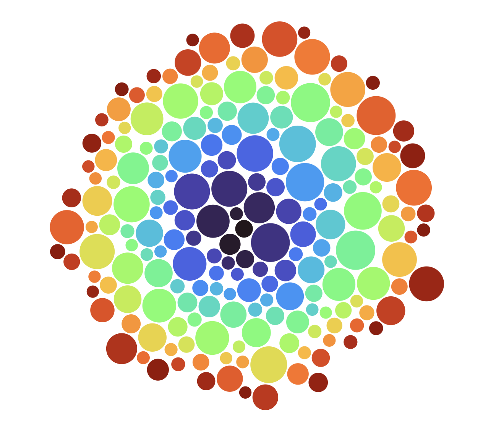
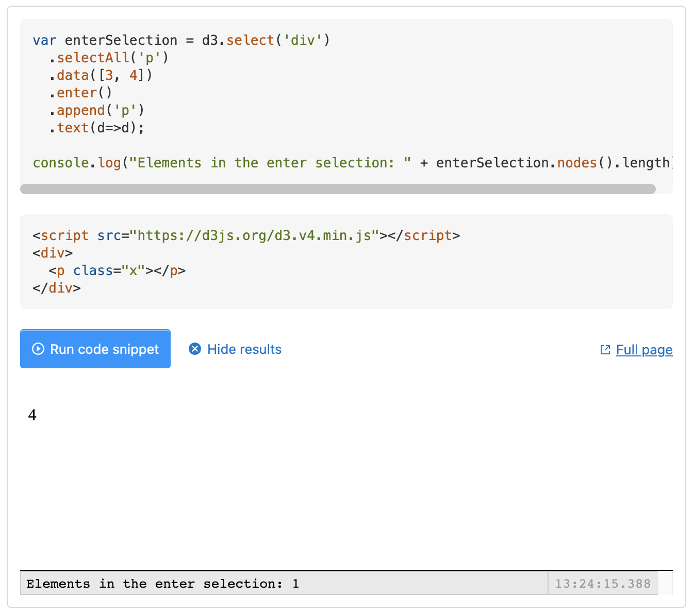
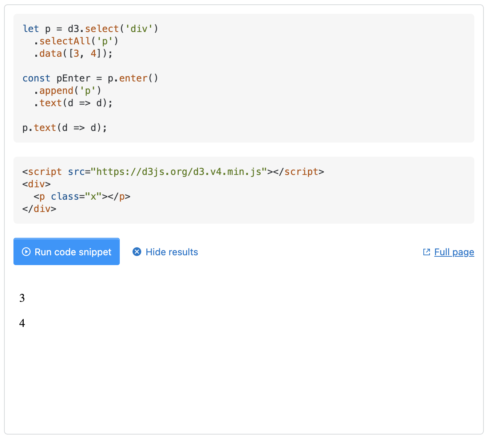
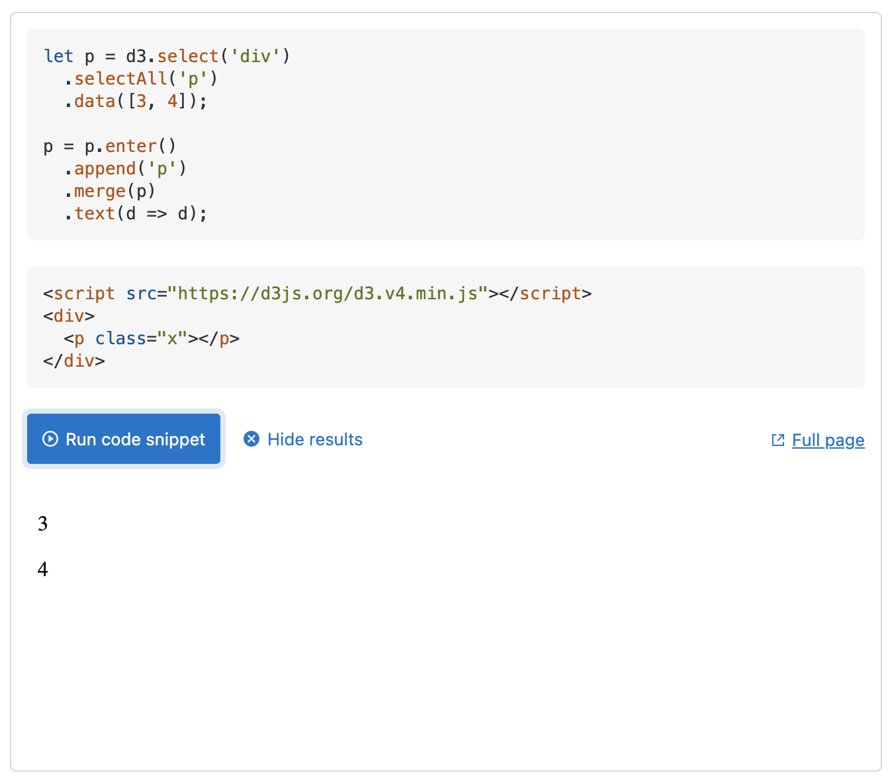

import Tabs from "@theme/Tabs";
import TabItem from "@theme/TabItem";

:::caution

DO NOT install all-in-one [d3][d3 on NPM] or [@types/d3][@types/d3 on NPM] in Messier-61 project

:::

Looking into data visualization it seems clear that the library with the greatest capability and flexibility is
[D3][D3], which has over a thousand methods. It goes down to such base components that it does not even consider itself
to be a data visualization library, but instead provides "efficient manipulation of documents based on data". Basically
it binds data to DOM objects and gives us lots of ways to manipulate them, which is used by a lot of people to
manipulate SVG graphics, and thus data visualization. It appears to have a bit of a learning curve but we are up for it.
I would rather learn something new than get bottle-necked later using a prebuilt library.

## Compatibility with React

There is a fundamental compatibility issue between React and D3. Because React creates a
[Virtual DOM][Virtual DOM], and D3 works by creating and manipulating objects in the actual DOM, we have to find a way
to get D3 working inside the Virtual DOM. This problem has been solved a number of different ways

We would think that there would just be a package that would handle this. There is a package called
[react-d3-library][react-d3-library] that purported to let us use stock D3 code in React with just a few adjustments.
However this package is no longer maintained and the last commit was 4 years ago. So this does not seem like the route
to go down.

Here are some of the other methods that people have written about.

Amelia Wattenberger has written an excellent article [React + D3][React + D3] where she basically advocates that we
shouldn't be using the D3 methods that render the SVG graphics, but to render them all manually using JSX and only use
D3 methods that do math like calculating scale. On the one hand she may have a point here, but on the other hand she is
basically throwing away the majority of the D3 methods and recreating them which is a huge duplication of effort. It's
almost as if her answer to the question of how to use D3 with React is "You don't".

The other sources that I have found seem to be on more of a similar page. They advocate a combination of `useRef` to
direct D3 to an SVG and `useEffect` to manipulate it.

- [griddynamics: Using D3.js with React.js: An 8-step comprehensive manual](https://blog.griddynamics.com/using-d3-js-with-react-js-an-8-step-comprehensive-manual/)
- [Pluralsight: Using D3.js Inside a React App](https://www.pluralsight.com/guides/using-d3.js-inside-a-react-app)
- [LogRocket: Using D3.js v6 with React](https://blog.logrocket.com/using-d3-js-v6-with-react/)

## Configurable D3 Graph

:::tip

### D3 with React Hooks

**React Function Components** with Hooks gives us a nice way to integrate D3 with React. There are many related articles
that describe this already but they get in the weeds and complicated quickly. This discussion is just the basics on
where to put things to get started correctly. We can expand from there.

In the past it was confusing to find the correct places to put D3 code, especially for someone new to D3 still getting
their head wrapped around D3's way of doing things. Optimization to minimize re-rendering was an advanced task when it
should be easy.

Function Components with Hooks cleans this up quite a bit. There is one place to put D3, one way to connect it to
React's DOM, and re-render logic is mostly built in.

### useRef Hook

We're building a function not a class. There are no class member variables so we need a way to hold onto an object
across multiple rendering passes.

**useRef()** creates a variable that does just that. The variable acts a lot like a class member variable without the
class. We utilize `useRef()` to hold onto the DOM element containing our D3 content. A ref is "get" and "set" via its
`.current` property.

### useEffect Hook

**useEffect()** gives us a place to put side effects such as our D3 code. It's a side effect because it adds content to
the DOM outside of React's virtual DOM mechanism.

::::::info

`useEffect()` is like `componentDidMount()` and `componentWillReceiveProps()` combined, with change detection as a
first-class feature.

::::::

:::

Here is the part of code that reflects the usage of `useRef` and `useEffect` as well as how Messier-61 components
handles drawing knowledge graph in D3

```typescript
import React, { useEffect, useRef } from "react";
import * as d3 from "d3";
import styles from "./D3Graph.module.css";
import type { Node, Link, GraphConfig } from "../GraphConfig";

export function D3Graph(graphConfig: GraphConfig): JSX.Element {
  const svgRef = useRef(null);

  const width = graphConfig.canvasConfig.width;
  const height = graphConfig.canvasConfig.height;

  const nodes: any[] = initializeNodes(graphConfig.graphData.nodes);
  let links: any[] = initializeLinks(graphConfig.graphData.links);

  useEffect(() => {
    ... // graph rendering and listener logics
  }, [nodes, links, svgRef.current]);

  const stylesName = [styles.g, styles.node, styles.line, styles.link, styles.newLine];
  return <svg ref={svgRef} width={width} height={height} className={stylesName.join(" ")}></>;
}

```

Here is what the code above is doing:

Call `useRef()` to create a variable (`svgRef`) to hold the SVG element. Initialize it as `null`. React will set it the
first time the page is rendered.

:::tip Why not just use `d3.select()` to get the SVG element, or insert the SVG element using pure D3?

By using a ref variable we can use it as a **dependency** in our `useEffect()` block to detect when the element has
actually been rendered and available.

:::

Call `useEffect()` to execute our D3 code which draws graph on canvas. `useEffect()` takes two arguments

1. a function to run, and
2. an array of dependency variables

`useEffect()` will run every time one of the dependency variables changes. Because we listed graph `nodes` and `links`
as dependencies, `useEffect()` will run again whenever graph data changes. We don't need to write code to compare old
and new data for changes anymore!

The Function Component returns an SVG element, and its ref attribute is set to `svgRef` - the ref variable we declared
at the top of the function.

React will run our D3 code when the DOM is ready and when the data changes.

### Generating Force Graph Simulation

**Due to changes in namespace from v3 to v4**. The force layout `d3.layout.force` has been
[renamed](https://github.com/d3/d3/blob/master/CHANGES.md#forces-d3-force) to [`d3.forceSimulation`][d3-force][^1]. _It
is, therefore, strongly recommended to read [`d3.forceSimulation` documentation][d3-force] thoroughly in order to
understand what the following discussion is talking about_. After that, we will discuss how the code snipped can be
changed to the following v4+ version:

```javascript
function initializeSimulation(nodes: any[], links: any[], width: number, height: number): any {
  return d3
    .forceSimulation(nodes)
    .force("charge", d3.forceManyBody().strength(DEFAULT_FORCE_STRENGTH))
    .force(
      "link",
      d3
        .forceLink()
        .distance(DEFAULT_LINK_DISTANCE)
        .id(function (d: any) {
          return d.id;
        })
        .links(links)
    )
    .force("center", d3.forceCenter(width / 2, height / 2));
}
```

The method above creates a new simulation with the specified array of nodes and forces. If nodes is not specified, it
defaults to the empty array. The simulator starts automatically.

Each node must be an _object_. The following properties are assigned by the simulation:

- **index** - the node's zero-based index
- **x** - the node's current x-position
- **y** - the node's current y-position
- **vx** - the node's current x-velocity
- **vy** - the node's current y-velocity

The position $(x, y)$ and velocity $(v_x, v_y)$ may be subsequently modified by [forces][forces] and by the simulation.
If either `vx` or `vy` is `NaN`, the velocity is initialized to $(0, 0)$. If either `x` or `y` is `NaN`, the position is
initialized in a [phyllotaxis arrangement][phyllotaxis arrangement] (shown below), so chosen to ensure a deterministic,
uniform distribution.



To fix a node in a given position, we may specify two additional properties:

1. **fx** - the node's fixed x-position
2. **fy** - the node's fixed y-position

At the end of each tick (explained below), after the application of any forces, a node with a defined _node_.fx has
_node_.x reset to this value and _node_.vx set to zero; likewise, a node with a defined _node_.fy has _node_.y reset to
this value and _node_.vy set to zero. To unfix a node that was previously fixed, set _node_.fx and _node_.fy to null, or
delete these properties.

If the specified array of _nodes_ is modified, such as when nodes are added to or removed from the simulation, this
method must be called again with the new (or changed) array to notify the simulation and bound forces of the change; the
simulation does not make a defensive copy of the specified array.

:::tip `simulation.tick([iterations])`

Manually steps the simulation by the specified number of _iterations_, and returns the simulation. If _iterations_ is
not specified, it defaults to 1 (single step).

:::

The `charge` and `link` have been changed to its new API versions which are
[forceManyBody](https://www.d3indepth.com/force-layout/#forcemanybody) and
[forceLink](https://www.d3indepth.com/force-layout/#forcelink), respectively.

The only effect that the old force layout.size had was to set the attraction point for the "gravity" force to be
[width / 2, height / 2]. This has been replaced by the positioning forces **d3.forceX** and **d3.forceY**[^2]

We are done with the graph setup. Next we will define its behavior

### Grouping Nodes and Links for Batch Operations

We prepare this grouping so that we can apply certain operations on each node/link, such as re-loading every existing
node onto canvas during a graph redraw.

We achieve that using the following lines of codes:

```javascript
const linesg = svg.append("g");
const circlesg = svg.append("g");
```

The `<g>` SVG element is a container used to group other SVG elements, i.e. nodes and links. D3 operations applied to
the `<g>` element are performed on its child elements of links and nodes, and its attributes are inherited by its
children. See [MDN Web Docs](https://developer.mozilla.org/en-US/docs/Web/SVG/Element/g) for more details.javascript

### Defining the Graph Re-Drawing

```javascript
const link = linesg
  .selectAll("line.link")
  .data(links)
  .attr("x1", function (d: any) {
    return d.source.x;
  })
  .attr("y1", function (d: any) {
    return d.source.y;
  })
  .attr("x2", function (d: any) {
    return d.target.x;
  })
  .attr("y2", function (d: any) {
    return d.target.y;
  })
  .classed("selected", function (d: any) {
    return d === selectedLink;
  });

// load all existing links
link.enter().append("line").attr("class", "link").attr("marker-end", "url(#child)").on("mousedown", linkMousedown);

// off-load obsolete links due to node removal
link.exit().remove();
```

Almost everyone learning about D3 is confused about the `selectAll` above: `const link = linesg.selectAll("line.link")`.
Why can we select things that don't exist yet? In order to fully comprehend that, we need to first discuss **enter()**
and **exit**

#### Understanding enter() and exit()

Let's consider yet another example:

```html
<body>
  <div>
    <p class="x"></p>
  </div>
  <script>
    d3.select("div")
      .selectAll("p")
      .data([3, 4])
      /**
       * if I uncomment this it works
       * but I don't want to call the
       * same function twice
       */
      // .text(d => d + '')
      .enter()
      .append("p")
      .text((d) => d + "");
  </script>
</body>
```

When we do this:

```javascript
d3.select("div").selectAll("p");
```

We're selecting all `<p>` elements inside the selected `div`. We have only one div (that doesn't matter, because
`select` selects the first one it gets anyway...) and only one `<p>` element inside it.

Then, we bind the data:

```javascript
.data([3, 4])
```

Thus, so far, we have:

- 1 element in the selection
- 2 data points in the data

Now comes the important part regarding the "enter" selection: we already have one `<p>` element in our selection. That
`<p>` element gets the first datum, `3`. The remaining datum is appended to a newly created `p` element, which is `4`.

Our "enter" selection contains all data points without a corresponding element. As we can see, since we have 1 element
in the selection and 2 data points, your "enter" selection has only 1 element. Let's show it:



In a nutshell, we have to compare the selection with the data: if we have more data than elements, the extra data will
be bound to elements belonging to the "enter" selection. If we have more elements than data, the extra elements without
corresponding data belong to the "exit" selection. In our case, the "exit" selection is empty.

Finally, if we want to update the text of our existing `<p>` element, we have to use an "update" selection. It can be a
bit more verbose, like this:



Or we can merge the enter selection and the update one, in a slightly smaller code:



In both examples the update selection is named `p`.

#### Understanding `linesg.selectAll("line.link")`

Always keep in mind, that D3 is all about _binding data to some DOM structure and providing the means of keeping the
data and the document in sync_.

- Select all `line` elements having class `link` . This may very well return an empty selection when we have no graph
  links on canvas, but it will still be a d3.selection.
- Bind data to this selection. Based on the above mentioned selection this will, on a per-element basis, compute a join
  checking if the new data is

  - not yet bound to this selection, or
  - has been bound before, or
  - was bound before but is not included in the new data any more.

  Depending on the result of this check the selection will be divided into an **enter**, an **update**, or an **exit**
  selection, respectively.

- Because our selection was empty in the first place. All data will end up in the **enter** selection and nothing
  happens in the following executions

  ```javascript
  .attr("x1", function (d: any) { return d.source.x; })
  .attr("y1", function (d: any) { return d.source.y; })
  .attr("x2", function (d: any) { return d.target.x; })
  .attr("y2", function (d: any) { return d.target.y; })
  .classed("selected", function (d: any) { return d === selectedLink; })
  ```

- The **enter** selection is then retrieved by calling `selection.enter()` or `link.enter()`
- We append the new `line` elements corresponding to the newly bound data by calling `selection.append("line")` on the
  enter selection.

### Defining Behavior

The remaining defines the behavior:

- [Element: mousedown event](https://developer.mozilla.org/en-US/docs/Web/API/Element/mousedown_event)

  - `linkMousedown`
  - `nodeMousedown`
  - `mousedown`

- [Element: mouseout event](https://developer.mozilla.org/en-US/docs/Web/API/Element/mouseout_event)

  - `nodeMouseout`

- [Element: mouseover event](https://developer.mozilla.org/en-US/docs/Web/API/Element/mouseover_event)

  - `nodeMouseover`

- [Element: keydown event](https://developer.mozilla.org/en-US/docs/Web/API/Element/keydown_event)

  - `windowKeydown`

- [Element: mousemove event](https://developer.mozilla.org/en-US/docs/Web/API/Element/mousemove_event)

  - `windowMousemove`

- [Element: mouseup event](https://developer.mozilla.org/en-US/docs/Web/API/Element/mouseup_event)

  - `windowMouseup`
  - Note that is we would like to implement the behavior of not drawing the link when either of the link endpoints
    contains a node, we would have something like the following:

    ```javascript
    if (selectedSourceNode != null && selectedTargetNode != null) {
      links.push({ source: selectedSourceNode, target: d });
      update();
    } else {
      newLine.remove();
      newLine = null;
    }
    ```

    The `newLine = null` makes sure the same behavior can repeat.

## Reference

- [D3 with React](https://ncoughlin.com/posts/d3-react/)
- [Simple D3 with React Hooks](https://medium.com/@jeffbutsch/using-d3-in-react-with-hooks-4a6c61f1d102)
- [Understanding enter() and exit()](https://stackoverflow.com/a/43357028)
- [Basic d3: why can you select things that don't exist yet?](https://stackoverflow.com/a/33401494)

[D3]: https://d3js.org/
[d3-force]: https://github.com/d3/d3-force
[d3 on NPM]: https://www.npmjs.com/package/d3
[@types/d3 on NPM]: https://www.npmjs.com/package/@types/d3

[forces]: https://github.com/d3/d3-force#simulation_force
[phyllotaxis arrangement]: https://observablehq.com/@d3/force-layout-phyllotaxis
[react-d3-library]: https://github.com/react-d3-library/react-d3-library
[React + D3]: https://wattenberger.com/blog/react-and-d3
[Virtual DOM]: https://reactjs.org/docs/faq-internals.html

[^1]: https://stackoverflow.com/questions/49441793/d3-difference-between-layout-force-forcesimulation-to-build-network-graph#comment85885511_49441793
[^2]: https://stackoverflow.com/a/62563459
